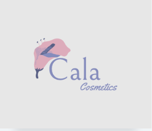

# grupo-03-Cala-Cosmetics

## Cala Cosmetics

1. Descripción de **productos/servicios**
En Cala creemos que un mundo más sustentable, inclusivo y libre de crueldad animal es posible.
Por esto es que decidimos crear una gama de productos cosméticos ecológicos, con ingredientes naturales, aceites esenciales, libres de parabenos o fragancias sintéticas, biodegradables y de producción local. También utilizando materiales para su envase biodegradables, renovables y reciclables. Y como estamos comprometidas a ser libres de crueldad animal, en nuestros productos no se realizarán pruebas en animales en ninguna etapa de su desarrollo. 

2. Descripción **público objetivo**
Nuestro público objetivo son mujeres de entre 25-35 anios con conciencia ecología y sustento económico propio. De nivel socio-cultural alto. 
Probablemente vegetarianas o veganas. Son mujeres que reciclan y dividen la basura.
Tienen huerta ya sea en su jardín si viven en una casa o algo pequenio en el balcón si viven en depto.
Les gusta comprar productos/servicios a emprendedores o productores locales.
No buscan precio al momento de comprar, sino productos con bajo impacto sobre el medioambiente.
Tienen al menos una mascota adoptada, no compran. Son voluntarias en refugios de animales.
Les gusta meditar y las actividades al aire libre. 

3. Descripción **Nosotras**
Cala Cosmetic es el resultado de una mágica fusión de pasiones, deseos y sueños compartidos por un grupo de amigas. Así surge el nacimiento de este emprendimiento hecho con mucho amor y compromiso con el medio ambiente y todos los seres que en él convivimos. Hace ya varios años que comenzamos a dar nuestros primeros pasos hacia una vida más consciente, respetuosa y amigable con la naturaleza. Hoy estamos, felices, entusiastas y seguras de que podremos aportar nuestro granito de arena, con nuestros productos 100% naturales, libres de tóxicos y químicos dañinos para nuestro cuerpo y nuestro planeta.
Cada producto está hecho a mano, con el cuidado y la dedicación que solo lo artesanal puede brindarte. Atentos a cada detalle, desde las fórmulas, hasta el embalaje está pensado para respetar nuestra filosofía y lleva una parte de nuestra historia.
Queremos invitarte a dar los primeros pasos hacia un estilo de vida más saludable.

4. Inspiracion
    -https://www.weleda.cl/
    -https://www.naturasiberica.com.ar/
    -https://ongteprotejo.org/ar/marcas-cruelty-free/
    -https://milaborit.com/
    -https://www.naturacosmeticos.com.ar/

5. Referentes de mercado
Dentro de la cosmética natural, con ingredientes naturales y que no utiliza animales en sus testeos, siendo así libre de crueldad animal, nos encontramos con la marca Natura, gran referente del mercado actual en belleza, comenzo en Brasil en el año 1969 en una pequeña tienda, luego paso a ser la primera empreza de cosmeticos de Latinoamerica  y hoy en dia es el cuarto referente de belleza en el mundo, Y todo esto se logró siendo écologica, sustentable, cruelty free,con verdadera  conciencia ambiental y utilizando el metodo de venta directo.
Natura fue, en muchas oportunidades, pionera en el mundo al lanzar productos con envolturas reutilizables y desarrolló una tabla ambiental que mostró a sus clientes cómo eran hechas las envolturas de sus productos y su compromiso con el medio ambiente y la sostenibilidad. Por esto y mucho mas creemos que Natura se lleva el premio mayor en cuanto a referentes de mercado.
Luego tenemos empresas a nivel nacional comprometidas de igual manera que nosotras y empresas del talle de Natura, las cuales nos sirven de referente quizás aún más, por el hecho de la magnituid de recursos que maneja Natura y que nosotras como principiantes todavía vemos muy lejos y estás empresas como: Milaborit, Mies cosmetica, Shiri natural y quizá en algunos aspectos Sri Sri tattva, nos sirven de ejemplo y de guia para lograr nuestros objetivos como marca.